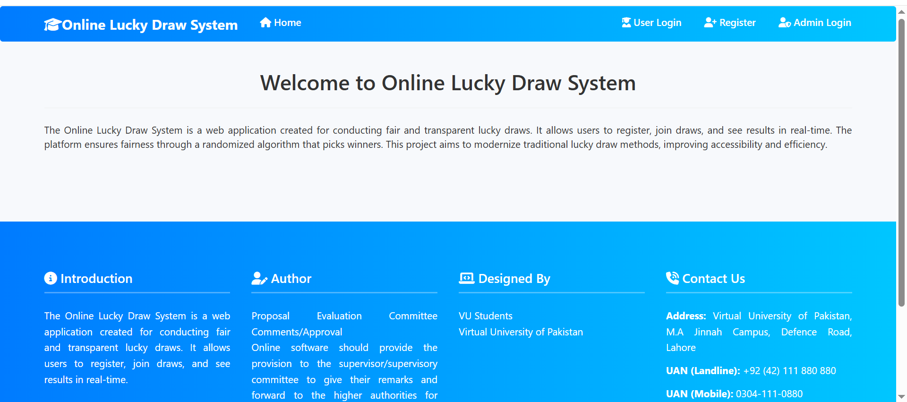
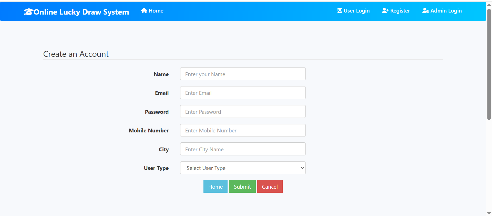
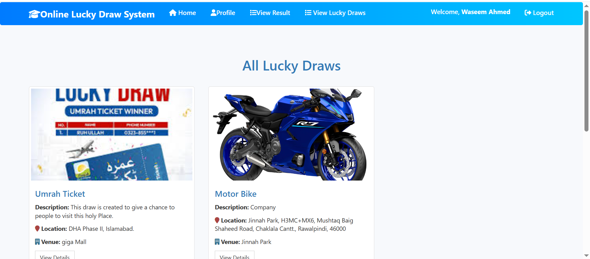
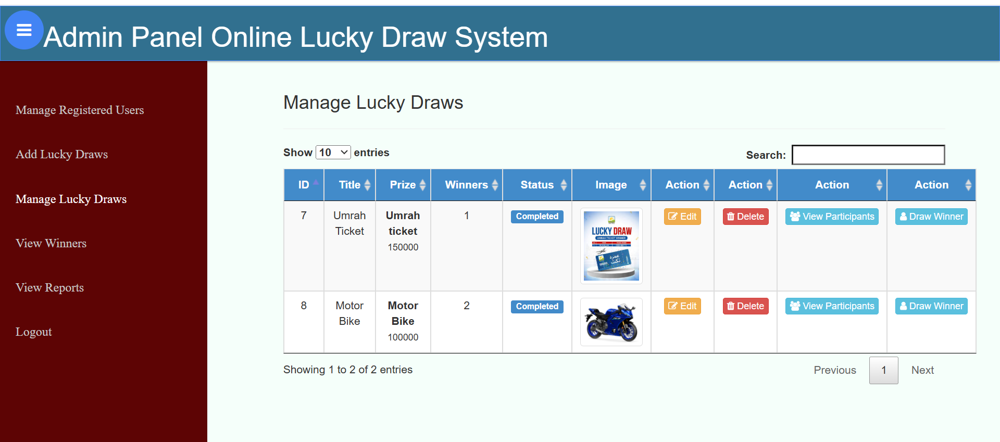
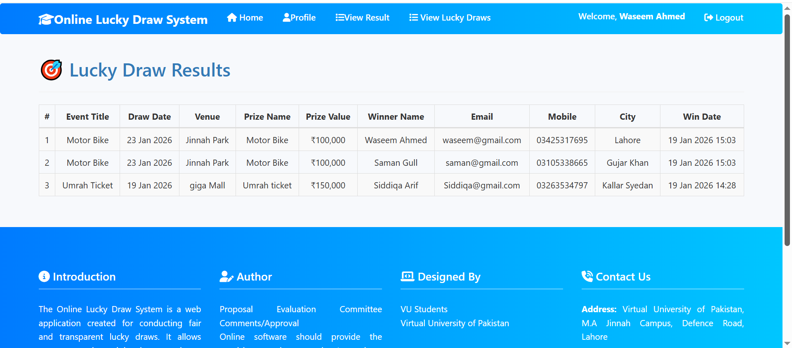
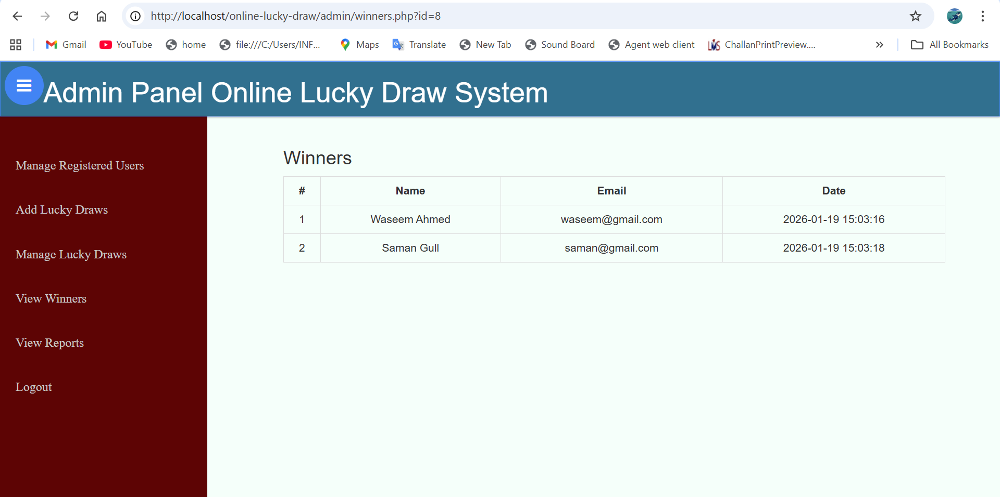
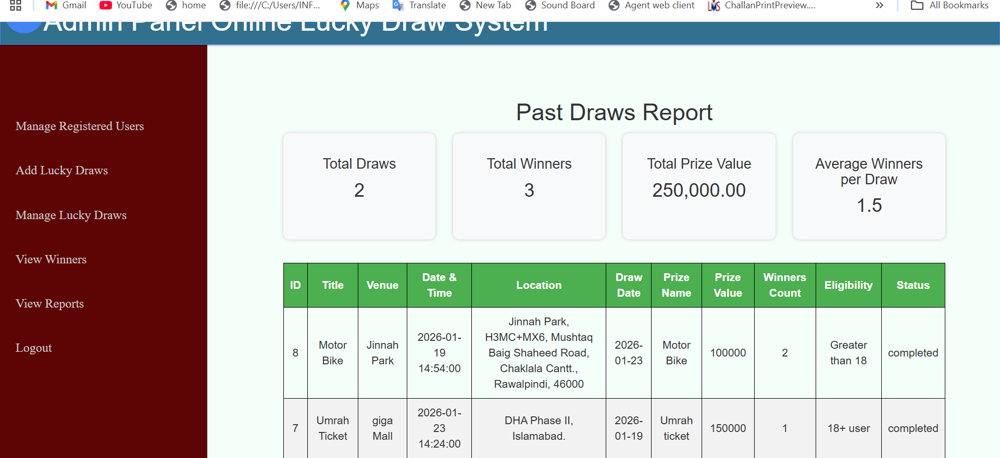

# Online Lucky Draw System

This is a web-based Online Lucky Draw System developed using PHP and MySQL.

## Technologies Used

- PHP
- MySQL
- HTML
- CSS
- Bootstrap
- JavaScript

## Features

### User Side

- User registration and login
- View active lucky draw events
- Participate in lucky draw

### Admin Side

- Admin login
- Create and manage lucky draw events
- Select random winners
- View participants list

## How to Run the Project

1. Install XAMPP
2. Place the project in `htdocs`
3. Import database from `/database/lucky_draw.sql`
4. Run in browser: `http://localhost/online-lucky-draw`

## Project Type

Final Year Project / Academic Project

## Developed By

Saman

## Screenshots

### Home Page

### User Registration

### Admin – Draws List

### Admin – Edit Draw

### Admin – Draw Winners

### Winners Page

### Reports

### Users Management

